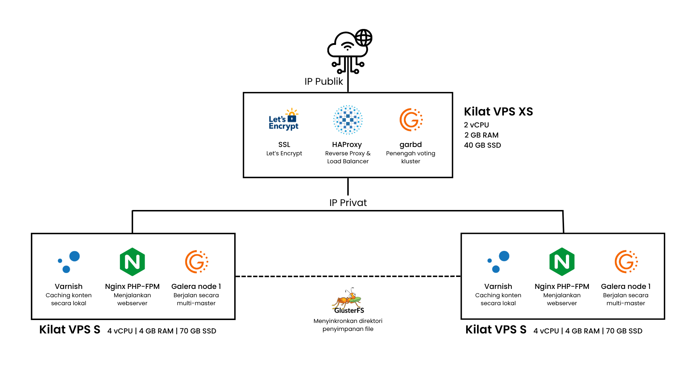

# Studi Kasus: Implementasi High Availability & Sistem Penanganan Lonjakan 10.000+ Pengguna

Repositori ini mendokumentasikan solusi infrastruktur mandiri untuk mengatasi kendala server down akibat lonjakan trafik masif pada platform e-commerce (Magento/PrestaShop). Studi kasus ini berfokus pada efisiensi resource, perancangan topologi, performance tuning menyeluruh pada OS, HAProxy, Nginx, & PHP, serta penerapan system hardening.

---

## 📋 Daftar Isi
1. [Latar Belakang & Permasalahan](#latar-belakang--permasalahan)
2. [Topologi & Arsitektur Solusi](#topologi--arsitektur-solusi)
3. [Manajemen Resource & Spesifikasi](#manajemen-resource--spesifikasi)
4. [System Hardening & Performance Tuning](#system-hardening--performance-tuning)
5. [Runtutan Pengerjaan & Troubleshooting](#runtutan-pengerjaan--troubleshooting)
6. [Kesimpulan](#kesimpulan)

---

## 1. Latar Belakang & Permasalahan
* **Skenario:** Sebuah perusahaan e-commerce dengan platform berbasis CMS Magento/PrestaShop mengalami lonjakan trafik hingga 10.000 user aktif secara bersamaan akibat kampanye diskon besar-besaran.
* **Kendala Awal:** Server sering mengalami down atau kegagalan layanan karena beban kerja terpusat secara tunggal (Single Point of Failure) pada satu Virtual Machine (VM) dengan spesifikasi resource XS.
* **Tujuan:** Merancang solusi infrastruktur yang andal, efisien, dan tahan banting untuk mendistribusikan beban kerja serta mengamankan sistem di bawah tekanan trafik tinggi.

---

## 2. Topologi & Arsitektur Solusi

* **Edge / Load Balancing Layer (Kilat VPS XS):** 
  * Menggunakan **HAProxy** sebagai *Reverse Proxy* dan *Load Balancer* utama yang langsung menghadap ke IP Publik.
  * Dilengkapi **Let's Encrypt SSL** untuk enkripsi lalu lintas HTTPS yang aman bagi pengguna.
  * Dilengkapi **Garbd** (*Galera Arbitrator daemon*) sebagai penengah voting kluster database tanpa harus memakan resource server beban penuh.
* **Application & Storage Layer (Kilat VPS S1 & S2):**
  * Dibagi menjadi dua *backend node* (Kilat VPS S1 dan S2) yang menjalankan web server **Nginx + PHP-FPM** dan CMS e-commerce.
  * **Varnish Cache** dipasang langsung di setiap *web node* untuk melakukan *caching* konten dinamis/statis secara lokal sehingga meringankan beban pemrosesan aplikasi secara drastis.
  * **GlusterFS** diimplementasikan di antara kedua node web untuk menyinkronkan direktori penyimpanan file (seperti media/upload produk) secara *real-time*, memastikan konsistensi data file di kedua server.
* **Database Layer (Galera Cluster):**
  * Menggunakan **Galera Cluster** (Galera DB node 1 dan node 2) yang berjalan secara multi-master. Sistem ini sangat mengefisiensikan operasi database karena memungkinkan pembacaan (*read*) dan penulisan (*write*) data secara sinkron di kedua node tanpa jeda replikasi yang lama, serta memberikan ketahanan tinggi jika salah satu node database mengalami gangguan.

---

## 3. Manajemen Resource & Spesifikasi
* **Edge Node (Kilat VPS XS):** 
  * Spesifikasi: 2 vCPU, 2 GB RAM, 40 GB SSD.
  * Peruntukan: Menangani alur masuk trafik publik, enkripsi SSL Let's Encrypt, *reverse proxy* HAProxy, dan arbitrasi kluster (garbd).
* **Backend Nodes (Kilat VPS S1 & S2):** 
  * Spesifikasi: 4 vCPU, 4 GB RAM, 70 GB SSD per node.
  * Peruntukan: Menjalankan Nginx + PHP-FPM, layanan *caching* lokal Varnish, sinkronisasi direktori media via GlusterFS, serta engine database mandiri berbasis Galera Cluster.

---

## 4. System Hardening & Performance Tuning
Optimalisasi performa dan keamanan diterapkan secara menyeluruh mencakup level OS, HAProxy, Nginx, hingga PHP-FPM:
* **Anti-DDoS & Rate Limiting di HAProxy:** Menerapkan konfigurasi pembatasan koneksi (*rate limiting*) di HAProxy untuk mendeteksi dan secara otomatis menutup/memblokir IP address yang melakukan *HTTP request* secara berulang dalam waktu bersamaan guna mencegah serangan *brute-force* atau DDoS layer 7.
* **SSL/TLS Security:** Integrasi sertifikat digital **Let's Encrypt** pada HAProxy untuk mengamankan koneksi jalur komunikasi publik.
* **HAProxy Performance Tuning:** Menyetel parameter *maxconn*, penyesuaian *timeout* (client, server, connect), serta pengelolaan antrean koneksi agar penanganan ribuan request konkuren tetap stabil.
* **Nginx Performance Tuning:** Mengoptimalkan jumlah *worker_processes*, *worker_connections*, mengaktifkan *sendfile*, *tcp_nopush*, *tcp_nodelay*, serta mengatur *keepalive_timeout* untuk efisiensi transfer data web.
* **PHP-FPM Performance Tuning:** Mengatur mode manajemen proses (`pm = dynamic` atau `pm = static`), penyesuaian jumlah *pm.max_children*, *pm.start_servers*, *pm.min_spare_servers*, dan *pm.max_spare_servers* agar penggunaan memori RAM tetap terjaga optimal saat menangani eksekusi skrip e-commerce yang masif.
* **Firewall & Kernel OS Tuning:** Menyesuaikan parameter kernel (`sysctl.conf`) serta batas maksimal deskriptor file (`nofile`) agar sistem mampu menangani puluhan ribu koneksi soket secara bersamaan.

---

## 5. Runtutan Pengerjaan & Troubleshooting
* **Fase Analisis:** Mengidentifikasi akar permasalahan dari bottleneck performa pada VM eksklusif ber-resource terbatas.
* **Fase Eksekusi:** Penyusunan topologi, pemesanan resource, instalasi komponen pendukung, dan penerapan skrip pengamanan.
* **Kendala & Troubleshooting Utama:** 
  * *Kendala Awal Varnish:* Pada tahap awal, Varnish sempat dipasang menyatu di server HAProxy. Akibatnya, integrasi dengan web application menjadi tidak berjalan maksimal dan membuat HAProxy kewalahan memproses beban *cache* sekaligus *load balancing*.
  * *Solusi:* Memindahkan posisi Varnish agar terdistribusi langsung ke setiap *web node* (Kilat VPS S1 & S2), sehingga beban *caching* terbagi merata dan HAProxy bisa fokus murni menangani lalu lintas trafik jaringan masuk (*proxy & load balancing*).

---

## 6. Kesimpulan
Implementasi arsitektur High Availability dengan pemisahan beban Varnish ke setiap *web node*, efisiensi kluster database Galera, sinkronisasi file GlusterFS, pengamanan *Anti-DDoS* & SSL Let's Encrypt di HAProxy, serta *performance tuning* komprehensif pada OS, HAProxy, Nginx, dan PHP terbukti mampu mengeliminasi titik kegagalan tunggal (SPOF), menjaga stabilitas layanan e-commerce, serta memastikan sistem tetap responsif melayani 10.000+ pengguna aktif secara bersamaan.
